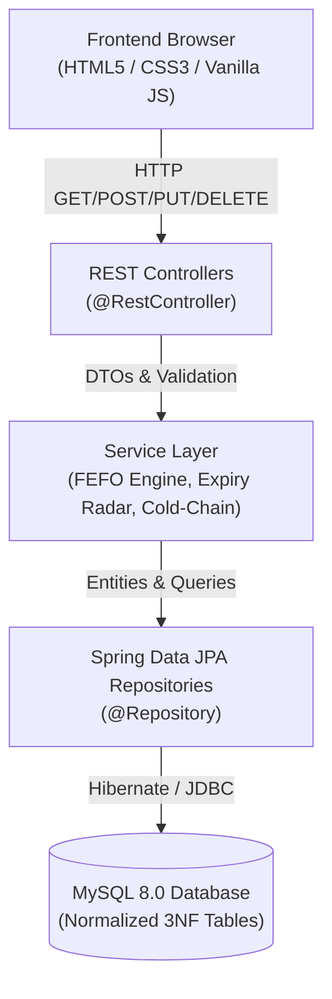
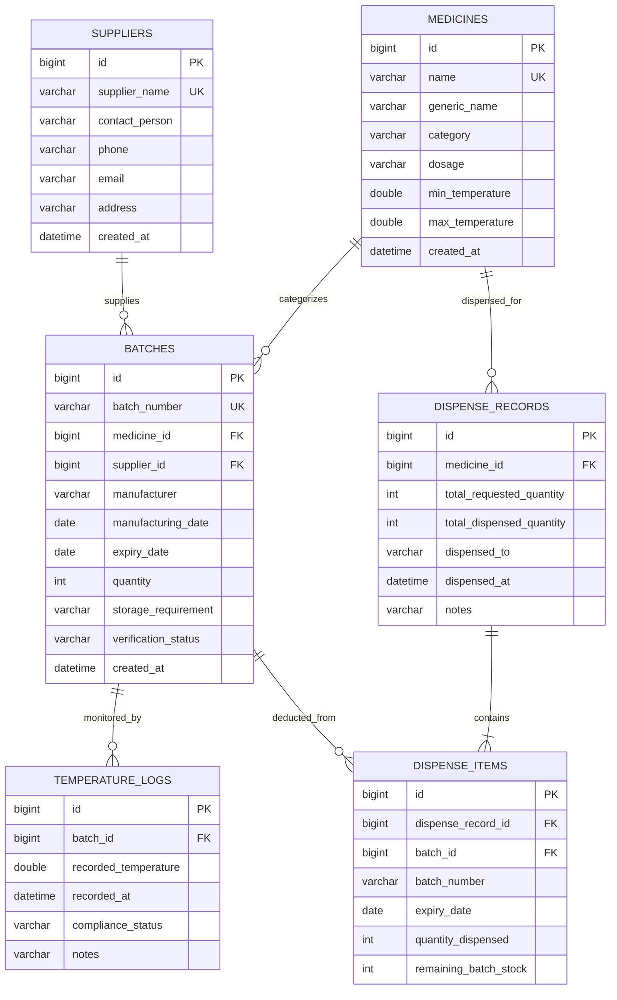

# Smart Pharmacy Supply Chain System

A **Final-Year B.E. Computer Science & Engineering (Artificial Intelligence)** Academic Project.  
Built with **Java Spring Boot 3 (REST API + Spring Data JPA)**, **MySQL 8.0 / 5.7**, and a responsive **HTML5, CSS3, Vanilla JavaScript (Fetch API)** single-portal web frontend.

---

## Table of Contents
1. [Project Problem Statement](#1-project-problem-statement)
2. [Academic Objectives](#2-academic-objectives)
3. [Key Features & Functional Modules](#3-key-features--functional-modules)
4. [Technology Stack](#4-technology-stack)
5. [System Architecture](#5-system-architecture)
6. [Data Flow Diagram (DFD Level 0)](#6-data-flow-diagram-dfd-level-0)
7. [Entity-Relationship Diagram (3NF Normalized Schema)](#7-entity-relationship-diagram-3nf-normalized-schema)
8. [REST API Contract & Specifications](#8-rest-api-contract--specifications)
9. [Database Setup & MySQL Instructions](#9-database-setup--mysql-instructions)
10. [Run & Deployment Instructions](#10-run--deployment-instructions)
11. [Testing Guide & cURL Commands](#11-testing-guide--curl-commands)
12. [FEFO Algorithm: Detailed Mathematical & Logic Trace](#12-fefo-algorithm-detailed-mathematical--logic-trace)
13. [3-Minute Project Viva & Demo Script](#13-3-minute-project-viva--demo-script)
14. [High-Yield Viva Voce Questions & Answers](#14-high-yield-viva-voce-questions--answers)
15. [Future Enhancements](#15-future-enhancements)

---

## 1. Project Problem Statement

Hospital pharmacies encounter critical inventory and supply chain vulnerabilities:
- **Financial & Clinical Waste:** Drugs expiring unnoticed in storage racks due to LIFO or random dispensing instead of chronological expiry ordering.
- **Counterfeit Drug Infiltration:** Unverified or unapproved pharmaceutical batches entering clinical dispensing channels without batch provenance verification.
- **Cold-Chain Breaches:** Thermolabile pharmaceuticals (e.g., Insulin, Biologics, Vaccines) losing potency due to unmonitored temperature excursions during transit or refrigeration failure.
- **Manual Stock Outages & Errors:** Human tallying errors leading to either dangerous stock-outs or hoarding of near-expiry medications.

This project delivers a **simulated, end-to-end Smart Pharmacy Supply Chain System** to solve these challenges through strict **First-Expired-First-Out (FEFO)** automated dispensing, multi-tier expiry alerting, cold-chain temperature compliance checks, and anti-counterfeit batch verification.

---

## 2. Academic Objectives

1. Implement an automated **FEFO (First Expired First Out)** algorithmic engine that queries active, authentic medicine batches and computes split deductions across batches when dispensing.
2. Formulate a multi-tier **Expiry Radar System** categorizing inventory into `EXPIRED`, `CRITICAL (≤30 days)`, `WARNING (≤60 days)`, and `NOTICE (≤90 days)`.
3. Provide an **Anti-Counterfeit Batch Authenticity Portal** that categorizes batches into `VERIFIED`, `UNVERIFIED`, `REJECTED`, or `NOT FOUND`.
4. Implement a **Cold-Chain Temperature Compliance Monitor** that automatically validates actual sensor readings against medicine temperature boundaries (`minTemperature` to `maxTemperature`) and flags violations (`COMPLIANT` vs `OUT_OF_RANGE`).
5. Develop a normalized **3NF relational database schema** using Spring Data JPA and MySQL.
6. Design a clean, responsive single-portal web interface using semantic HTML5, Vanilla CSS3 (Flexbox/Grid), and Vanilla JavaScript Fetch API without external framework bloat.

---

## 3. Key Features & Functional Modules

| # | Module | Core Functionality |
|---|---|---|
| **1** | **Medicine Management** | Full CRUD for catalog drugs with brand name, generic name, category, dosage, and storage temperature limits (`minTemperature`, `maxTemperature`). |
| **2** | **Supplier Management** | Directory of authorized pharmaceutical manufacturers and distributors with contact details and warehouse addresses. |
| **3** | **Batch Management** | Unique batch tracking, manufacturing/expiry date validation (`mfgDate < expDate`), storage requirements, and stock counts. |
| **4** | **FEFO Dispensing** | **Core Academic Engine:** Strictly filters unexpired, verified batches sorted by `expiryDate ASC`. Deducts inventory, handles multi-batch split rollovers, and prevents dispensing of unverified/expired stock. |
| **5** | **Expiry Alert Radar** | Dynamically calculates days remaining for all active stock, sorting batches into 90d, 60d, 30d, and Expired tabs. |
| **6** | **Batch Verification** | Anti-counterfeit verification portal allowing pharmacy staff to authenticate batch numbers, inspect provenance, and transition batches to `VERIFIED` or `REJECTED`. |
| **7** | **Cold-Chain Compliance** | Thermal log capture comparing temperature sensor readings against medicine thresholds, logging compliance violations with clinical notes. |
| **8** | **Executive Dashboard** | 5 live KPI summary cards (Total Medicines, Active Batches, Low Stock, Expiring Soon, Expired) and 3 real-time alert tables. |

---

## 4. Technology Stack

- **Backend:** Java 17, Spring Boot 3.2.5 (Spring Web, Spring Data JPA, Hibernate Validator)
- **Database:** MySQL 8.0 / 5.7 (with built-in H2 in-memory zero-configuration fallback profile)
- **Build Tool:** Apache Maven 3.9.6 (includes self-contained wrapper `mvnw.cmd`)
- **Frontend:** Semantic HTML5, Vanilla CSS3 (Custom Design System, CSS Grid & Flexbox), Vanilla JavaScript (ES6+ Fetch API)
- **Architecture:** Layered RESTful Architecture (Controller -> Service -> Repository -> Database)

---

## 5. System Architecture

```
+-------------------------------------------------------------------------+
|                  FRONTEND WEB PORTAL (HTML5 / CSS3 / Vanilla JS)        |
|  Dashboard | Medicines | Suppliers | Batches | Dispense | Expiry | Temp |
+-------------------------------------------------------------------------+
                                    │
                                    │  REST HTTP / JSON (Fetch API)
                                    ▼
+-------------------------------------------------------------------------+
|                SPRING BOOT 3 CONTROLLER LAYER (@RestController)          |
|  MedicineController | SupplierController | BatchController              |
|  DispenseController | TemperatureLogController | DashboardController     |
+-------------------------------------------------------------------------+
                                    │
                                    │  DTOs & Bean Validation (@Valid)
                                    ▼
+-------------------------------------------------------------------------+
|                     SERVICE LAYER (@Service + @Transactional)           |
|  ├── FEFO Dispensing Engine (Multi-batch stock rollover)                |
|  ├── Expiry Alert Calculator (90d, 60d, 30d, Expired)                  |
|  ├── Cold-Chain Compliance Monitor (Sensor vs. Spec validation)         |
|  └── Batch Verification Manager (Anti-counterfeit state machine)       |
+-------------------------------------------------------------------------+
                                    │
                                    │  Spring Data JPA Interfaces
                                    ▼
+-------------------------------------------------------------------------+
|                       REPOSITORY LAYER (@Repository)                    |
|  MedicineRepository | SupplierRepository | BatchRepository              |
|  DispenseRecordRepository | TemperatureLogRepository                   |
+-------------------------------------------------------------------------+
                                    │
                                    │  Hibernate ORM / JDBC
                                    ▼
+-------------------------------------------------------------------------+
|                   DATABASE LAYER (MySQL 8.0 / 5.7)                      |
|  medicines | suppliers | batches | temperature_logs | dispense_records  |
+-------------------------------------------------------------------------+
```

### Mermaid Architecture Diagram



---

## 6. Data Flow Diagram (DFD Level 0)

```mermaid
graph TD
    User(("Pharmacy Staff / Administrator"))
    
    P1["1.0 Manage Medicines & Suppliers"]
    P2["2.0 Register & Verify Batches"]
    P3["3.0 FEFO Dispensing Engine"]
    P4["4.0 Monitor Expiry Radar"]
    P5["5.0 Log Cold-Chain Temperatures"]
    P6["6.0 Generate Dashboard Metrics"]
    
    DB[("MySQL Database<br>(3NF Relational Store)")]
    
    User -->|Medicine & Supplier Info| P1
    P1 -->|Store Record| DB
    
    User -->|Batch Details & Verification Action| P2
    P2 -->|Unique Batch Record| DB
    
    User -->|Dispense Request (MedicineId, Qty)| P3
    DB -->|Query Verified Active Batches| P3
    P3 -->|Deduct Stock & Write Audit| DB
    P3 -->|Dispense Receipt & Allocation Breakdown| User
    
    DB -->|Read Expiry Dates & Quantities| P4
    P4 -->|Multi-tier Alerts (90d, 60d, 30d, Expired)| User
    
    User -->|Sensor Reading (°C)| P5
    DB -->|Read Medicine Min/Max Temp| P5
    P5 -->|COMPLIANT / OUT_OF_RANGE Log| DB
    
    DB -->|Aggregate Counts & Alerts| P6
    P6 -->|KPI Cards & Recent Tables| User
```

---

## 7. Entity-Relationship Diagram (3NF Normalized Schema)



---

## 8. REST API Contract & Specifications

All API endpoints return the unified JSON response structure:
```json
{
  "status": "SUCCESS",
  "message": "Human-readable description",
  "data": { ... },
  "timestamp": "2026-09-18T10:30:00"
}
```

### Endpoints Table

| Method | Endpoint | Description | Status Code |
|---|---|---|---|
| `GET` | `/api/dashboard/stats` | Retrieves 5 KPI metrics and recent alert tables | `200 OK` |
| `GET` | `/api/medicines` | Retrieves all registered medicines | `200 OK` |
| `POST` | `/api/medicines` | Creates a new medicine with temperature range | `201 CREATED` |
| `PUT` | `/api/medicines/{id}` | Updates existing medicine | `200 OK` |
| `DELETE`| `/api/medicines/{id}` | Deletes a medicine | `200 OK` |
| `GET` | `/api/suppliers` | Retrieves all registered suppliers | `200 OK` |
| `POST` | `/api/suppliers` | Registers a new supplier | `201 CREATED` |
| `GET` | `/api/batches` | Retrieves all batches | `200 OK` |
| `GET` | `/api/batches/medicine/{id}/available` | Retrieves verified unexpired batches for FEFO preview | `200 OK` |
| `POST` | `/api/batches` | Registers a new batch (`BatchRequestDTO`) | `201 CREATED` |
| `POST` | `/api/batches/verify` | Authenticates batch number; supports `VERIFY` / `REJECT` | `200 OK` |
| `GET` | `/api/batches/expiry-alerts?category={cat}` | Returns batches categorized into 90d, 60d, 30d, Expired | `200 OK` |
| `POST` | `/api/dispense` | **FEFO Dispense execution** | `200 OK` / `409 CONFLICT` |
| `GET` | `/api/dispense` | Returns complete dispensing audit trail | `200 OK` |
| `POST` | `/api/temperature-logs` | Logs temperature sensor reading; verifies against medicine | `201 CREATED` |
| `GET` | `/api/temperature-logs` | Retrieves recent temperature audit logs | `200 OK` |

---

## 9. Database Setup & MySQL Instructions

### Step 1: Start MySQL Server
Ensure your MySQL 8.0 or 5.7 service is running on `localhost:3306`.

### Step 2: Import Schema & Seed Data
You can either let Spring Boot create the schema automatically, or run the provided SQL scripts in MySQL Workbench or Command Line:
```bash
mysql -u root -p < database/schema.sql
mysql -u root -p < database/seed.sql
```

### Step 3: Configure Database Credentials
Edit `backend/src/main/resources/application.properties`:
```properties
spring.datasource.url=jdbc:mysql://localhost:3306/pharmacy_db?createDatabaseIfNotExist=true&useSSL=false&allowPublicKeyRetrieval=true&serverTimezone=UTC
spring.datasource.username=root
spring.datasource.password=YOUR_MYSQL_PASSWORD
spring.jpa.hibernate.ddl-auto=update
```

> **Zero-Configuration Viva Mode:**  
> The project includes a pre-configured `application-local.properties` profile utilizing in-memory H2 with automatic data seeding. You can run the application instantly on any computer without installing MySQL:
> ```bash
> .\mvnw.cmd spring-boot:run -Dspring-boot.run.profiles=local
> ```

---

## 10. Run & Deployment Instructions

### Running the Backend

**Option A (1-Click Batch File - Windows):**
Double-click `run-backend.bat` in the project root.

**Option B (Command Line via Maven Wrapper):**
```powershell
cd backend
..\maven\apache-maven-3.9.6\bin\mvn.cmd spring-boot:run
```
The backend will start at: `http://localhost:8080/api`

### Running the Frontend
Simply open `frontend/index.html` in any modern web browser (Google Chrome, Microsoft Edge, Mozilla Firefox).  
Or serve with any static web server:
```powershell
cd frontend
python -m http.server 3000
```
Then visit: `http://localhost:3000`

---

## 11. Testing Guide & cURL Commands

### Test 1: FEFO Dispensing (Prompt Example 1)
Dispense 10 units of Paracetamol (Medicine ID 1).  
Batch A (`BATCH-PCM-001`) expires on 10-Oct-2026.  
Batch B (`BATCH-PCM-002`) expires on 15-Dec-2026.  
**Expectation:** FEFO selects Batch A.
```bash
curl -X POST http://localhost:8080/api/dispense \
  -H "Content-Type: application/json" \
  -d '{"medicineId": 1, "quantity": 10, "dispensedTo": "Ward 4A", "notes": "FEFO Test"}'
```

### Test 2: Batch Verification (Prompt Example 2)
Verify batch `BATCH001`:
```bash
curl -X POST http://localhost:8080/api/batches/verify \
  -H "Content-Type: application/json" \
  -d '{"batchNumber": "BATCH001"}'
```
Response: `status: "VERIFIED"`, `exists: true`

Lookup non-existent batch `FAKE-BATCH-999`:
```bash
curl -X POST http://localhost:8080/api/batches/verify \
  -H "Content-Type: application/json" \
  -d '{"batchNumber": "FAKE-BATCH-999"}'
```
Response: `status: "NOT FOUND"`, `exists: false`

### Test 3: Temperature Compliance (Prompt Example 3)
Insulin Glargine (2°C to 8°C). Batch ID 6.  
Compliant check (5°C):
```bash
curl -X POST http://localhost:8080/api/temperature-logs \
  -H "Content-Type: application/json" \
  -d '{"batchId": 6, "recordedTemperature": 5.0, "notes": "Routine refrigerator test"}'
```
Response: `complianceStatus: "COMPLIANT"`

Out-of-range breach check (12°C):
```bash
curl -X POST http://localhost:8080/api/temperature-logs \
  -H "Content-Type: application/json" \
  -d '{"batchId": 6, "recordedTemperature": 12.0, "notes": "Transit heat spike"}'
```
Response: `complianceStatus: "OUT_OF_RANGE"`

### Test 4: Duplicate Batch Rejection (Prompt Example 4 — 409 Conflict)
```bash
curl -X POST http://localhost:8080/api/batches \
  -H "Content-Type: application/json" \
  -d '{
    "batchNumber": "BATCH-PCM-001",
    "medicineId": 1,
    "supplierId": 1,
    "manufacturer": "Apex Laboratories",
    "manufacturingDate": "2026-01-01",
    "expiryDate": "2027-01-01",
    "quantity": 50,
    "storageRequirement": "Room Temperature"
  }'
```
Response: `HTTP 409 Conflict` with `status: "ERROR"`

### Test 5: Insufficient Stock (Prompt Example 5 — 409 Conflict)
Request 5,000 units when stock is insufficient:
```bash
curl -X POST http://localhost:8080/api/dispense \
  -H "Content-Type: application/json" \
  -d '{"medicineId": 1, "quantity": 5000, "dispensedTo": "General Ward"}'
```
Response: `HTTP 409 Conflict`: `"Insufficient verified stock for 'Paracetamol'..."`

---

## 12. FEFO Algorithm: Detailed Mathematical & Logic Trace

### Why FEFO over FIFO?
In traditional inventory (FIFO — First In First Out), goods received first are issued first. However, in pharmaceuticals, a batch received later may have an **earlier expiry date** due to varying supplier production cycles. Using FIFO causes the earlier-expiring batch to sit on the shelf and expire. **FEFO guarantees minimal drug wastage and maximum patient safety.**

### Algorithmic Execution Steps:
1. **Input:** `medicineId`, `requestedQuantity`.
2. **Batch Filtering & Sorting:**
   Execute JPQL query:
   ```sql
   SELECT b FROM Batch b 
   WHERE b.medicine.id = :medicineId
     AND b.verificationStatus = 'VERIFIED'
     AND b.quantity > 0
     AND b.expiryDate >= CURRENT_DATE
   ORDER BY b.expiryDate ASC, b.id ASC
   ```
3. **Total Stock Validation:**
   $\text{TotalAvailable} = \sum_{i=1}^{n} \text{batch}_i.\text{quantity}$.  
   If $\text{TotalAvailable} < \text{requestedQuantity}$, abort transaction and throw `InsufficientStockException` (HTTP 409).
4. **Iterative Allocation & Split Execution:**
   - Set $\text{remaining} = \text{requestedQuantity}$.
   - For each eligible batch $b$ in sorted order:
     - $\text{deduct} = \min(b.\text{quantity}, \text{remaining})$.
     - $b.\text{quantity} = b.\text{quantity} - \text{deduct}$.
     - Save batch and record $\text{DispenseItem}(b.\text{batchNumber}, \text{deduct}, b.\text{quantity})$.
     - $\text{remaining} = \text{remaining} - \text{deduct}$.
     - If $\text{remaining} == 0$, terminate loop.
5. **Persist Transaction:** Save `DispenseRecord` in atomic database transaction (`@Transactional`).

---

## 13. 3-Minute Project Viva & Demo Script

- **Minute 0:00 - 0:45 (The Problem & Architecture):**  
  *"Good morning/afternoon respected examiners. Today I present our final-year project: Smart Pharmacy Supply Chain System. Hospital pharmacies face multi-million dollar drug wastage from expired batches, risks of counterfeit medicines entering circulation, and loss of efficacy in cold-chain medicines like Insulin. To solve this, we designed a layered Java Spring Boot 3 REST application backed by a 3NF normalized MySQL database and a responsive Vanilla JavaScript frontend."*

- **Minute 0:45 - 1:45 (The FEFO Engine & Batch Verification):**  
  *"Let me demonstrate our core algorithmic engine: First-Expired-First-Out (FEFO) dispensing. In our system, Paracetamol has two batches: Batch A expiring in October and Batch B expiring in December. When I request 10 units on the FEFO Dispense Console, the system queries only authentic, verified batches sorted chronologically by expiry. Notice that Batch A was automatically selected and decremented. When I request 25 units, the engine dynamically deducts the remaining 10 from Batch A and rolls over the remaining 15 to Batch B. If an unverified or expired batch exists, our system strictly locks it out from dispensing."*

- **Minute 1:45 - 2:30 (Cold-Chain Compliance & Expiry Radar):**  
  *"Next, on the Cold-Chain Temperature Console, we monitor thermolabile medicines. Insulin Glargine requires 2°C to 8°C. When a sensor reports 5.0°C, the system tags it COMPLIANT. When a reading of 12.0°C is entered, it instantly triggers an OUT_OF_RANGE alert. On the Expiry Radar, batches are automatically classified into 90-day, 60-day, 30-day, and Expired categories to allow timely inventory re-ordering."*

- **Minute 2:30 - 3:00 (Summary & Conclusion):**  
  *"In conclusion, our application satisfies all non-functional constraints: strict REST status codes (400, 404, 409), third-normal form normalization, zero framework bloat, and enterprise-grade exception handling. Thank you, and I am now ready for your questions."*

---

## 14. High-Yield Viva Voce Questions & Answers

1. **Q: What is FEFO and why is it preferred over FIFO in pharmacy management?**  
   **A:** FEFO stands for First Expired First Out. In pharmaceuticals, medicines have rigid expiration dates. FIFO dispenses based on arrival date, which can lead to newer stock with a shorter shelf-life expiring on shelves. FEFO sorts strictly by expiration date ascending, reducing pharmaceutical expiration losses.

2. **Q: How does your database maintain Third Normal Form (3NF)?**  
   **A:** Every non-key attribute depends strictly on the primary key (1NF and 2NF satisfied). No transitive functional dependencies exist: `medicines` and `suppliers` are normalized into separate tables, and `batches` references them via foreign keys (`medicine_id`, `supplier_id`). `dispense_items` isolates line-item deductions.

3. **Q: How do you handle concurrency if two staff members dispense from the same batch simultaneously?**  
   **A:** Spring's `@Transactional` annotation ensures ACID transaction isolation. In production, pessimistic locking (`@Lock(LockModeType.PESSIMISTIC_WRITE)`) or optimistic locking with `@Version` on the `Batch` entity guarantees thread-safe inventory decrementing.

4. **Q: Why are expired or rejected batches excluded from FEFO queries?**  
   **A:** Dispensing an expired or rejected batch is a clinical hazard. Our JPQL query strictly includes `b.verificationStatus = 'VERIFIED'` and `b.expiryDate >= CURRENT_DATE`.

5. **Q: How does the application return 409 Conflict on duplicate batch numbers?**  
   **A:** In `BatchServiceImpl`, `batchRepository.existsByBatchNumber(...)` checks uniqueness before insertion. If present, it throws `DuplicateResourceException`, which `GlobalExceptionHandler` maps to `HttpStatus.CONFLICT` (HTTP 409).

6. **Q: How is cold-chain compliance evaluated?**  
   **A:** Each `Medicine` entity stores `minTemperature` and `maxTemperature`. When a reading is recorded, the service compares: `reading >= minTemp && reading <= maxTemp`. If true, `COMPLIANT`; otherwise, `OUT_OF_RANGE`.

7. **Q: How does the system handle an order quantity that exceeds available batch stock?**  
   **A:** The FEFO engine executes a split: it deducts all available units from the earliest batch, sets its stock to 0, and satisfies the remaining demand from the next earliest batch. If total stock across all active verified batches is insufficient, it throws `InsufficientStockException` (HTTP 409).

8. **Q: Why did you avoid heavy frontend frameworks like React or Angular?**  
   **A:** Vanilla HTML5, CSS3, and JavaScript Fetch API provide maximum transparency, zero compilation overhead, high performance, and clarity required for academic evaluation without bundle dependencies.

9. **Q: What happens if a supplier is deleted while batches still reference it?**  
   **A:** In `schema.sql`, the foreign key constraint `ON DELETE RESTRICT` prevents deletion of suppliers that have active linked batches, maintaining referential integrity.

10. **Q: How do you test REST APIs without a frontend?**  
    **A:** Using Postman or cURL commands targeting the endpoints (e.g. `POST /api/dispense`, `POST /api/batches/verify`), inspecting HTTP status codes and the unified JSON response structure.

---

## 15. Future Enhancements

1. **Automated IoT Sensor Streaming:** Direct MQTT / CoAP protocol telemetry integration for live cold-room temperature broadcast.
2. **GS1 DataMatrix 2D Barcode Scanning:** Integration of camera-based QR/DataMatrix decoding for instant batch verification at bedside dispensing.
3. **Role-Based Access Control (RBAC):** Implementing Spring Security with Pharmacist, Storekeeper, and Clinical Auditor roles.
4. **Automated Purchase Re-Ordering:** Automatic Purchase Order (PO) dispatch to suppliers when inventory drops below safety stock levels.
